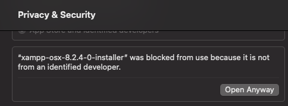
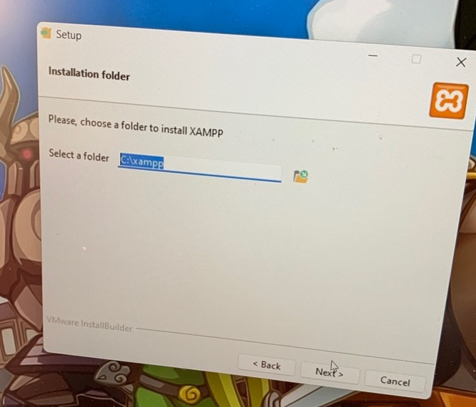
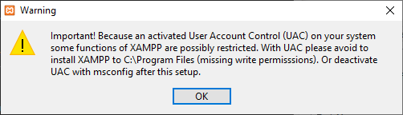
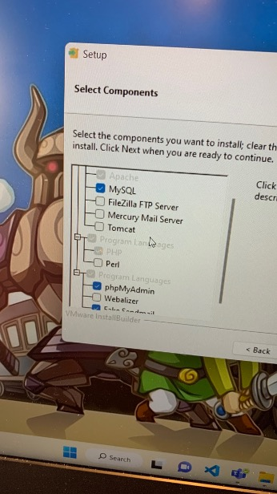
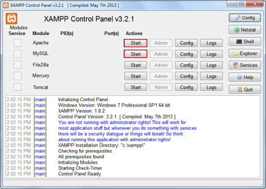
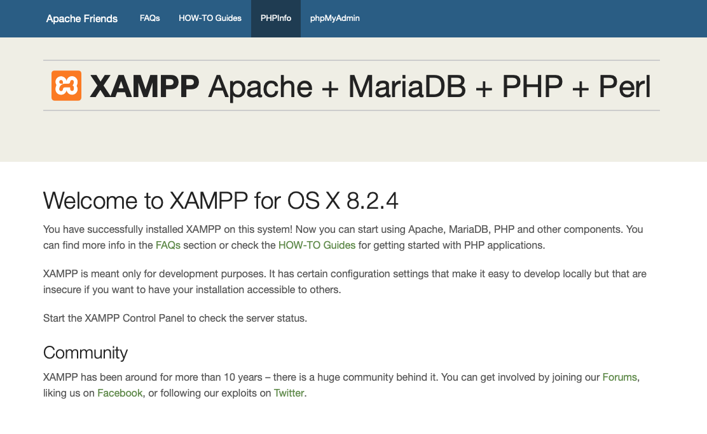
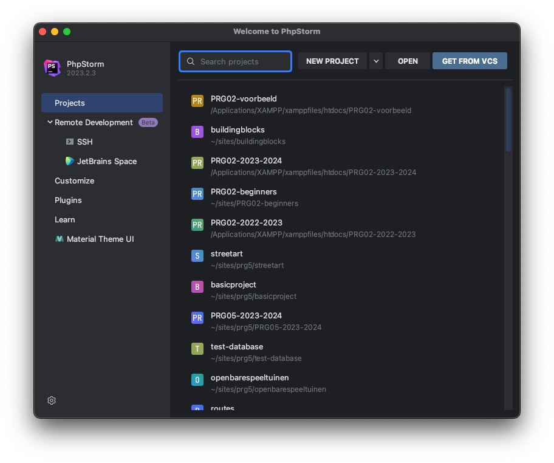
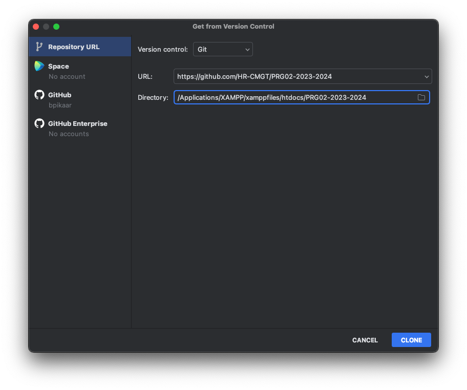
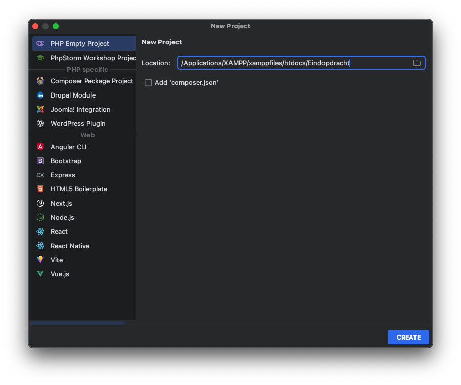

    Installatiestappen webserver en IDE

## Inhoud 

- [Download](#Download)
- [Jetbrains Account](#jetbrains-account)
- [Installatie](#installatie)
  - [XAMPP](#xampp)
  - [Jetbrains Toolbox](#jetbrains-toolbox)
  - [GIT](#git)
- [Configuratie](#configuratie)
  - [PHP](#php)
  - [Error handling](#error-handling)
  - [htdocs](#htdocs)
- [PHP Projecten](#php-projecten)
  - [Lesopdrachten](#lesopdrachten)
  - [Werkmap](#werkmap)
  - [Eindopdracht](#eindopdracht)
- [GitHub Student Developer Pack](#GitHub-student-developer-pack)
  - [Domeinnaam](#domeinnaam)

--------------------

## Download

- Download de laatste versie (8.2) van [XAMPP](https://www.apachefriends.org/download.html)
- Download de [Jetbrains Toolbox](https://www.jetbrains.com/toolbox-app/)
- Download [GIT](https://git-scm.com/downloads)

--------------------

## Jetbrains Account

Jetbrain biedt de studenten de mogelijkheid, zolang je studeert, om gratis gebruik te maken 
van hun software. Hiervoor moet je een account aanmaken op de 
[Jetbrains website](https://www.jetbrains.com/shop/eform/students). Gebruik hiervoor je e-mailadres
van de Hogeschool Rotterdam.

--------------------

## Installatie

### XAMPP

- Dubbelklik de installer
  Mocht je op de Mac de installer niet kunnen openen, dan kun je het volgende proberen:
  - Open Settings > Security & Privacy > Scroll naar Security > Kies "Open Anyway"
    
  - Werkt dit nog niet? 
    - Kopieer de "xampp-osx-8.2.4-0-installer" uit de diskimage naar je download folder
    - en voer dan het volgende via Terminal.app uit:  
    ```bash
    xattr -dr com.apple.quarantine ~/Downloads/xampp-osx-8.2.4-0-installer.app
    ```
- Als er gevraagd wordt om de locatie te wijzigen, **doe dit niet**. Het is 
    belangrijk dat je XAMPP installeert in de map `C:\xampp`

- Het kan ook zijn dat je op windows de volgende melding krijgt. Omdat je XAMPP installeert
    in de map `C:\xampp` is dit geen probleem. Je kunt deze warning negeren.
  
- Wanneer er gevraagd wordt welke onderdelen je wilt installeren, zorg dan dat 
    de volgende onderdelen geselecteerd zijn (voor **Windows**):
    - Apache
    - MySQL
    - PHP 
    - phpMyAdmin
    - [Optioneel] Fake Sendmail 
  
  Op de **Mac** kies je voor de volgende onderdelen:
  - XAMPP Core Files
  
  

Tip: Zorg er voor dat het XAMPP Controle Panel altijd maar 1 x draait. Wanneer je in je system tray kijkt
kan je daar het oranje icoontje van XAMPP zien. Als deze er al staat, **start het Control Panel
<u>niet</u> nog een keer**! Doe je dit wel, dan is de kans groot dat je database corrupt raakt en
zal je stappen uit de [XAMPP Hotline](./XAMPP-HOTLINE.md) moeten ondernemen.


### Jetbrains Toolbox

- Dubbelklik de installer en volg de stappen
- Open de toolbox en log in met je Jetbrains account
- Installeer PHPStorm vanuit de toolbox. Voer eventueel nogmaals je Jetbrains account in 
  als er bij het opstarten om gevraagd wordt.

### GIT

- **Windows**: Dubbelklik de installer en volg de stappen
- **Mac**: De meeste Macs hebben GIT al geïnstalleerd. Open Terminal en typ `git --version`. 
  Als je een versienummer ziet, is GIT al geïnstalleerd en kan je deze stap overslaan.
  Zo niet, dan kun je GIT installeren via de [GIT website](https://git-scm.com/download/mac). Ik zou de Homebrew optie 
  aanraden. Dit zal je op de Mac later ook nog nodig hebben. 
--------------------

## Configuratie

### PHP

- Open de XAMPP control panel (_Manager-osx_ op de Mac)
- Start Apache en MySQL. 
  
  - Start Apache niet op? Sluit dan alle programma's die gebruik maken van poort 80. 
    Denk hierbij aan Skype, Dropbox, Google Drive, Discord, etc.
  - Start MySQL niet op? Herstart dan je pc of Mac.
- Open een browser en ga naar [http://localhost](http://localhost)
- Je ziet nu de XAMPP dashboard pagina. 
  
- Als je dit ziet, **is de installatie van je webserver gelukt!**
- Wil je weten of je databaseserver ook werkt, klik dan op phpMyAdmin in het menu van het Dashboard. 
  of ga naar [http://localhost/phpmyadmin/](http://localhost/phpmyadmin/)

### Error handling

Het is nu zaak om te zorgen dat je foutmeldingen te zien krijgt als er iets mis gaat.

- Klik op PHPinfo in het menu van het Dashboard. 
- Je ziet nu een pagina met alle PHP-instellingen en welke versie van PHP draait op jouw server. 
  Dit moet versie 8.2.0 of hoger zijn.
- Scroll naar het onderdeel _Loaded Configuration File_ dit is het configuratiebestand dat door PHP is geladen. 
- Open dit bestand in PHPStorm of in een TextEditor. 
- Zoek op: _error_reporting=_
- Zorg ervoor dat de waarde op **E_ALL** staat. Dit betekent dat alle fouten getoond worden.
- Direct eronder staat display_errors. Zorg ervoor dat deze op **On** staat. 
  Dit betekent dat de fouten ook daadwerkelijk getoond worden.
- Sla het bestand op en herstart de Apache server. Pas na een restart is de wijziging actief.

### htdocs

- Open de map htdocs uit de XAMPP folder. 
  - Windows: `C:\xampp\htdocs`
  - Mac: `/Applications/XAMPP/htdocs`
- Hier zie je het bestand index.php. Dit is het bestand dat het Dashboard laadt. 
- Hernoem dit bestand naar index.php.bak.
- Open nu nogmaals [http://localhost](http://localhost)
- Je ziet nu een mappenstructuur. Dit maakt het makkelijk om een project te kiezen. 
  
## PHP Projecten

In de `htdocs` map gaan we drie projecten maken. Het eerste project komt van GitHub en dat is het project met 
alle **lesopdrachten en voorbeelden**. Het tweede project is de **werkmap** waarin je alle lesopdrachten
uitwerkt. Het laatste project is het project met de **eindopdracht**. Hierin komt de website te staan die je deze cursus 
gaat maken en die je aan het einde van de cursus inlevert als eindopdracht.

### Lesopdrachten

- Ga naar de [GitHubpagina](https://GitHub.com/HR-CMGT) van CMGT en dan specifiek de [repository 
  van Programmeren 2](https://GitHub.com/HR-CMGT/PRG02-2023-2024)
- Hier zie je een groene knop met de tekst **Code**. Klik hierop en kopieer de `https` link die je ziet staan.
- Ga nu naar PHPStorm kies voor _Get from VCS_.
  
- Plak de link van GitHub bij url en bij Directory navigeer je naar de htdocs map.
  
- Klik op Clone en wacht tot het project is gedownload.
- Je ziet nu een map met de naam PRG02-2023-2024. Dit is het project met alle lesopdrachten en voorbeelden. Je 
  kunt deze map openen in de browser via [http://localhost/](http://localhost/) 

### Werkmap

- Maak een nieuwe map aan in de htdocs map en noem deze `prg02-werkmap`
- Wanneer je aan de lesopdrachten gaat werken, kopieer je de folder van de les naar deze map. 
  Zo kun je de lesopdrachten uitwerken zonder dat je de originele lesopdrachten aanpast.

### Eindopdracht

- Ga in PhpStorm naar _File > New Project_
- Kies voor empty PHP Project. 
- Geef de folder de naam `prg02-eindopdracht`.
- En plaats deze in de htdocs folder.
  
- Klik op Create en je ziet nu een lege map met de naam eindopdracht.

**Toevoegen aan GitHub**

Om ervoor te zorgen dat jouw project veilig is opgeslagen, voeg je deze toe aan GitHub. 

- Als het project open staat, klik je op _VCS > Share Project on GitHub_
- Eventueel moet je hierna inloggen met je GitHub account.
- Klik op Share en je project wordt geüpload naar GitHub.

## GitHub Student Developer Pack

Als onderdeel van de GitHub Student Pack heb je toegang tot allerlei gratis diensten, waaronder een gratis
account op GitHub Pro. Hiermee kun je onbeperkt private repositories aanmaken. $200 aan gratis tegoed op
Digital Ocean voor cloud hosting, een jaar lang gratis domeinnaam registratie op Namecheap en nog veel meer.

- Om toegang te krijgen tot deze diensten, ga je naar [https://education.GitHub.com/pack](https://education.GitHub.com/pack)
- Klik op _Get student benefits_
- Kies voor _Student_
- En gebruik het e-mailadres van de Hogeschool Rotterdam als je het account aanmaakt.

### Domeinnaam

Via the student pack kan je bij namecheap een domeinnaam (.me) registreren.
 - bezoek https://nc.me/GitHub/auth
 - login met je GitHub account behorende bij het student pack (e-mailadres van de Hogeschool Rotterdam)
 - Geef namecheap toegang tot je GitHub account
 - Kies een domeinnaam en registreer deze
 - Je hebt nu een domeinnaam die je kunt gebruiken voor je eindopdracht en deze kun je beheren in het [dashboard](https://ap.www.namecheap.com/).
 - Klik op Domain List > Domain > Redirect domain. 
 - bij Source url vul je je domeinnaam in (zonder http://) en bij Destination URL vul je het adres van je eindopdracht in.

### Cloud Hosting

Nadat je je hebt aangemeld voor het Student Developer Pack, kun je een gratis account aanmaken op Digital Ocean.

- Ga naar [https://www.digitalocean.com/github-students](https://www.digitalocean.com/github-students)
- Klik op _Redeem your DigitalOcean credit_
- Log in met je Github account (gebruik de knop _Sign up with Github_)
- _Authenticate with GitHub_ en geef Digital Ocean toegang om je e-mailadres uit te lezen.
- Je hebt nu je eigen cloud hosting account.
- Deze kun je bezoeken via [https://cloud.digitalocean.com](https://cloud.digitalocean.com)
