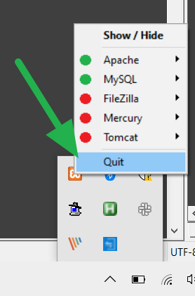
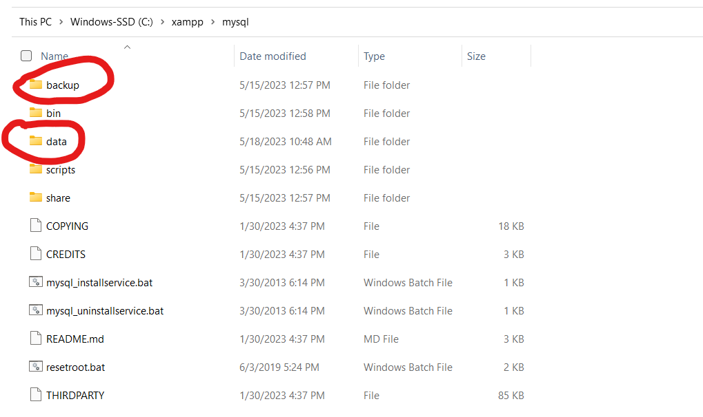
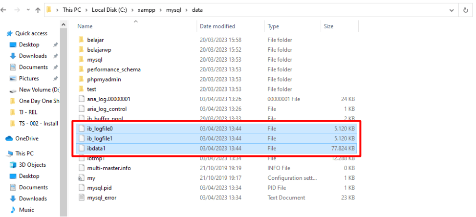
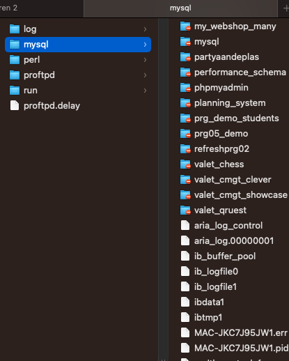

# XAMPP Hotline

Deze pagina is bedoeld als eerstelijns hulp bij problemen met XAMPP. Hopelijk kun je hiermee snel
je probleem verhelpen en weer verder met je werk. Mocht je toch nog tegen problemen aanlopen, zoek
dan zo snel mogelijk contact met je eigen docent.

Tip: Zorg er voor dat het XAMPP Controle Panel altijd maar 1 x draait. Wanneer je in je system tray kijkt
kan je daar het oranje icoontje van XAMPP zien. Als deze er al staat, **start het Control Panel 
<u>niet</u> nog een keer**! Doe je dit wel, dan is de kans groot dat je database corrupt raakt en 
zal je stappen hieronder nodig hebben. 

|  | 
|:---------------------------------------------------:| 
|          *XAMPP afsluiten via je taskbar*           |

> [!IMPORTANT]
> Tijdens het gebruiken van XAMPP is het belangrijk XAMPP altijd goed op te starten en af te sluiten.
> Doe je dit niet, dan kan het voorkomen dat er problemen ontstaan, vooral met MySQL.
> **Je XAMPP afsluiten betekent in je taakbalk rechtermuisknop en exit. Alleen op het kruisje drukken
> is niet voldoende aangezien hij XAMPP dan enkel minimaliseert. Zorg dat je altijd je Apache en MySQL
> eerst stopt voordat je XAMPP volledig sluit.**

## Apache wil niet starten

Als Apache niet start heeft dit vaak 1 reden, namelijk dat je poort geblokkeerd is. Apache wil starten
op poort 80. Als een andere applicatie hier ook op draait kan dit problemen veroorzaken. Skype en
Teamviewer zijn 2 bekende programma's die potentieel ook op die poort draaien.

## MySQL wil niet starten

MySQL heeft over het algemeen geen poort conflicten aangezien poort 3306 heel specifiek is, en eigenlijk
alleen MySQL hier zelf gebruik van maakt. Dit zou enkel een probleem kunnen worden als je ooit al een
andere MySQL hebt geïnstalleerd die nog aan staat op diezelfde poort.

### Wat dan wel?

Door het verkeerd afsluiten van XAMPP (of omdat je computer misschien een keer is vastgelopen), kunnen de
interne MySQL bestanden corrupt zijn geraakt.

> [!WARNING]
> Hou er rekening mee dat je jouw aangemaakte databases allemaal kwijt bent. Dat is helaas een gevolg dat
> je op dit punt bent gekomen. Het is daarom niet onverstandig om regelmatig tussendoor een export van je
> databases te maken in phpMyAdmin.

#### Windows

|  | 
|:--------------------------------------------------------:| 
|              *XAMPP data & backups folders*              |

|  | 
|:--------------------------------------------------------:| 
|              *XAMPP ibdata en iblog files*               |

- Ga naar je `C:\xampp\mysql` map
- Kopieer en plak je `data` map zodat je hier een backup van hebt. Die map kun je dan `data_old` noemen
- Kopieer en plak je `backup` map en hernoem deze terug naar `data`
- Probeer je MySQL te starten
    - Lukt dit?
        - Probeer dan vanuit je `data_old` map databases die je had terug te kopiëren naar de nieuwe
          `data` map.
        - Doe dit stuk voor stuk en herstart je MySQL om te kijken of het nog steeds werkt.
    - Lukt dit niet?
        - Dan is het probleem wat groter en is een ander bestand ook corrupt. Verwijder ook je ibdata en iblog files
        - Probeer MySQL opnieuw te starten nadat je deze bestanden hebt verwijderd
    - Lukt dit ook niet?
        - Ga door naar [last resort & backups](#last-resort--backups)

#### Mac

|  | 
|:------------------------------------------------:| 
|              *Mysql locatie op Mac*              |

- Ga naar /Applications/XAMPP/var/mysql
- Verwijder je ibdata en iblog files
- Probeer je MySQL te starten
    - Lukt dit niet? Ga door naar [last resort & backups](#last-resort--backups)

## Last resort & Backups

Als je er niet uitkomt, en je docent weet ook geen directe oplossing kan het altijd nog een optie zijn XAMPP
volledig van je laptop te gooien en opnieuw te installeren. Zorg er wel voor dat je dan een backup maakt van
je htdocs map. Tevens is het aan te raden je databases te exporteren via phpMyAdmin.
