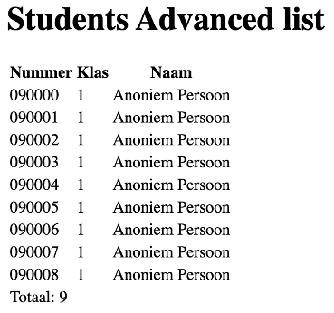

# Advanced les 1

## Onderwerpen

- [OOP PHP](http://www.php.net/manual/en/language.oop5.php)

## Opdrachten

### Opdracht 1: Samen nadenken over objecten (klassikaal)

Gezamenlijk: uitdenken welke objecten er allemaal in een lokaal zijn. Benoemen van de objecten,
hun eigenschappen en hun functionaliteiten.

### Opdracht 2: Student list uitdenken & samen code schrijven (klassikaal)

|  |
|:--------------------------------------------:|
|         *Student list eindresultaat*         |

We gaan aan de slag met het bouwen van een studentenlijst (zie afbeelding) met de OOP-mindset.
Bedenk welke objecten er zijn en benoem hun eigenschappen en hun functionaliteiten.

De code van de opdracht werken we samen uit in de les om een structuur neer te zetten. Je zult
merken dat je veel code schrijft terwijl de output nog steeds hetzelfde kleine lijstje met studenten is.
Dit is ook onderdeel van een mindset, dat je de structuur neerzet om je applicatie 'future-proof' te
maken. Als je later verder gaat en dingen wilt uitbouwen, dan zou je structuur je moeten helpen. In de
komenden lessen gaan we deze structuur stap voor stap uitbouwen tot een volwassen structuur die steeds
meer scenario's kan afhandelen.

De uitwerking staat na de les in de [example](example) map.

### Opdracht 3: Muziekalbums index & detail bouwen

Maak een map aan in je werkmap van programmeren 2 (die je tijdens de installatie binnen CLE hebt aangemaakt).
Noem deze map "music-collection" zodat je hier kunt gaan bouwen aan deze opdracht.

|  | 
|:---------------------------------------------:| 
|             *Muziekalbums index*              |

|  | 
|:-----------------------------------------------:| 
|              *Muziekalbums detail*              |

Zorg ervoor dat je een lijstje met muziekalbums maakt. Maak hierbij de index en de detailpagina
Pas hierbij de theorie van Advanced (OOP) programmeren toe. Zie afbeeldingen hierboven welke data op
de pagina's zichtbaar moet zijn.

Binnen de [example](example) map staat de uitwerking van de studentenlijst die OOP is gemaakt in de les.
Deze kun je als referentie voor de opdracht gebruiken. **Let op:** Gebruik dus geen databases, maar
ga echt uit van dezelfde set-up als in het uitgewerkte voorbeeld. Vanaf les 3 gaan we met een database
werken.

### Opdracht 4: Keuze maken eindopdracht

Na het uitvoeren van deze oefeningen en bijwonen van de eerste les moet je voor jezelf de volgende
keuzes maken:

1. Ga je de advanced les verder volgen? Ga je liever toch naar de reguliere les? Of volg je beide?
2. Hoe wil je jouw eindopdracht gaan opzetten? Dit mág met advanced technieken, maar dat hoeft niet!
   Maak hier vooral een keuze waar je jezelf vertrouwd in voelt. De toetsing is voor iedereen hetzelfde, dus
   je hebt de vrijheid om ook kleine delen uit de advanced les toe te passen in voor jou meer vertrouwde basiscode
