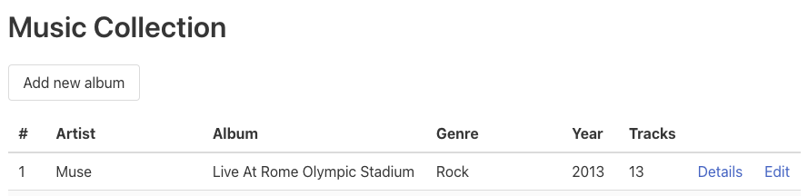
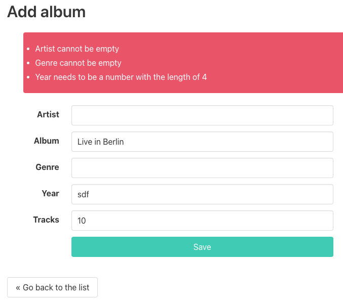
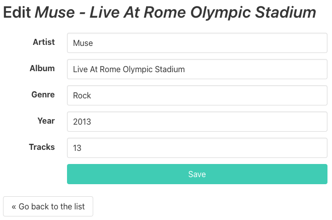

# Advanced les 2

## Onderwerpen

- [Extends](http://php.net/manual/en/keyword.extends.php)
- [Interface](http://www.sunilb.com/php/php5-tutorials-abstract-class-and-interface)
- [Namespaces](http://www.php.net/manual/en/language.namespaces.basics.php)

## Opdrachten

### Opdracht 1: Code lezen en vragen stellen

Kopieer de [uitwerking](../lesson1/assignment) naar je eigen werkmap (in de map "music-collection"
die je afgelopen les hebt aangemaakt) en overschrijf je eigen uitwerking. Hiermee heb je weer een
gelijk startpunt om door te gaan met de volgende opdrachten.

Om goed te weten hoe je zelf aan verder kunt, is het aan te raden deze code te lezen/analyseren.
Neem de overgenomen code door om er zeker van te zijn dat je die snapt. Zet waar nodig comments in
je code met vragen voor de docent zodat je die kunt bespreken.

### Opdracht 2: Muziekalbums create & edit

|  | 
|:---------------------------------------------:| 
|             *Muziekalbums index*              |

|  | 
|:-----------------------------------------------:| 
|              *Muziekalbums create*              |

|  | 
|:-------------------------------------------:| 
|             *Muziekalbums edit*             |

Voeg binnen de bestaande structuur 2 pagina's toe. We hebben nu een index en een detail, maak nu ook
een create en edit pagina aan. Zie bovenstaande afbeeldingen voor de precieze werking van de vragen.
Op beide pagina's komt een formulier te staan, zorg dat het volgende werkt:

- De indexpagina krijgt een link naar de create en edit pagina's
- De create pagina start met een leeg formulier
- De edit pagina start met een ingevuld formulier met huidige data van het album
- Bij verzenden wordt validatie toegepast die foutmeldingen geeft als velden verkeerd zijn ingevuld

**Let op:** Er gebeurt nog helemaal niks met de verzonden data. Dit gaan we vanaf volgende les doen als
we een database gaan toevoegen. Je hoeft dus geen aanpassing te doen in het JSON-bestand!!

### Opdracht 3: Namespaces & interface toepassen

Vanuit de gezamenlijke demo hebben we de student list voorzien van uitgebreidere technieken. De frontend
is identiek gebleven, maar de code is verder geprofessionaliseerd. De uitwerking kun je terugvinden in
de [example](example) map van deze les.

Pas nu zelf in je eigen muziekalbums opdracht de volgende technieken toe:

- Deel je classes op in mappen (en dus namespaces!). Categoriseer ze zodat op zo'n manier dat je voor
  jouw gevoel op een logische plaatst staan.
- Herschrijf je validatie uit vorige opdracht. Maak een 'Validator' interface en zorg dat je een 'AlbumValidator'
  class hebt die hier gebruik van maakt. Kun je bedenken welke functionaliteiten voor elke toekomstige
  validatie relevant zijn?
