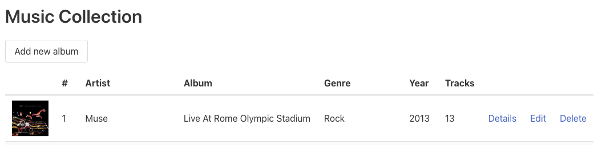

# Advanced les 3

## Onderwerpen

- [PDO](http://www.php.net/manual/en/book.pdo.php)
- [MYSQLi](http://www.php.net/manual/en/book.mysqli.php)
- [PDO vs. MYSQLi](http://net.tutsplus.com/tutorials/php/pdo-vs-mysqli-which-should-you-use/)
- [PDO Prepared Statements](https://www.php.net/manual/en/pdo.prepare.php)
- [PDO Transactions](https://www.php.net/manual/en/pdo.transactions.php)

## Opdrachten

### Opdracht 1: Code lezen en vragen stellen

Kopieer de [uitwerking](../lesson2/assignment) naar je eigen werkmap (in de map "music-collection"
die je afgelopen les hebt aangemaakt) en overschrijf je eigen uitwerking. Hiermee heb je weer een
gelijk startpunt om door te gaan met de volgende opdrachten.

Om goed te weten hoe je zelf aan verder kunt, is het aan te raden deze code te lezen/analyseren.
Neem de overgenomen code door om er zeker van te zijn dat je die snapt. Zet waar nodig comments in
je code met vragen voor de docent zodat je die kunt bespreken.

### Opdracht 2: Database aanmaken via phpMyAdmin & koppelen met phpStorm

Na de demo kun je zelf aan de slag met databases via PDO. Voordat we de code ingaan ga je eerst
een database aanmaken met 1 tabel als startpunt van de opdracht.

- Maak een nieuwe database 'music_collection' aan via phpMyAdmin
- Maak een nieuwe table aan genaamd 'albums' met de juiste kolommen
- Vul een aantal rijen zodat je data hebt om straks in te laden
- **PRO TIP:** Koppel je database in phpStorm zodat je rechtstreeks vanuit 1 omgeving
  zowel bij je code als je database kunt. Extra voordeel is dat je ook autocompletion
  op je queries krijgt!

### Opdracht 3: Index & Detail koppelen aan database

Nu we een database hebben kunnen we starten met bouwen. We starten met de 2 pagina's die data
uitlezen en zetten deze om naar het gebruiken van de database.

- Verwijder de data map met het JSON-bestand, want we hebben nu een database!
- Zorg ervoor dat je de database gegevens aan je settings.php toevoegt, en de Database class
  uit het [voorbeeld](example) van vandaag gebruikt
- Zorg dat zowel de index als detail pagina's nu de data uit de database halen
    - Let er bij de detailpagina op om Prepared Statements te gebruiken

### Opdracht 4: Create, Edit koppelen aan database

Nu de data is uitgelezen op ons scherm gaan we data opslaan in de database. Daarvoor zijn zowel de
create als editpagina relevant.

- Voeg de database functionaliteit toe aan de create pagina zodat de informatie in de database
  opgeslagen wordt
- Voeg de database functionaliteit toe aan de editpagina zodat de informatie in de database
  bijgewerkt wordt

### Opdracht 5: Delete

|  | 
|:-----------------------------------------------:| 
|              *Muziekalbums delete*              |

Nu we alle queries voor **CRU** hebben geschreven, moeten we alleen de "**D**" nog toevoegen.

- Voeg een kolom toe aan de tabel naast 'detail' en 'edit' waarin de 'delete' knop komt te staan
- Als je hierop klikt, wordt het album uit de database verwijderd

### (Optioneel) Opdracht 6: Afbeeldingen

Als je het leuk vindt, kun je zelf op zoek gaan naar mogelijkheden om ook een afbeelding per album
toe te voegen. Hou hierbij rekening met het volgende:

- Voor het uploaden van afbeeldingen moet je in de `<form>` tag `enctype="multipart/form-data"` als
  attribuut toevoegen
- In PHP gebruik je `$_FILES` om bestanden op te halen
- Bestanden sla je nooit op in de database als BLOB. Je slaat altijd een link op naar het plaatje, en
  slaat het plaatje zelf op in een map in je project
