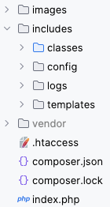
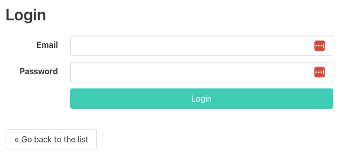
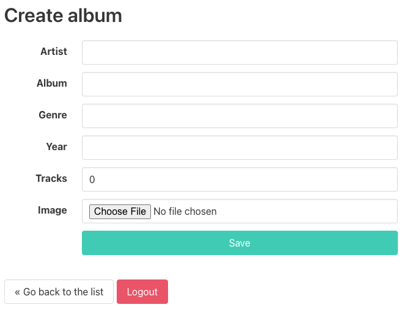

# Advanced les 5

## Onderwerpen

- [Abstract vs. Interface](https://codeinphp.github.io/post/abstract-class-vs-interface/)
- [Abstract](http://php.net/manual/en/language.oop5.abstract.php)
- [Traits](http://php.net/manual/en/language.oop5.traits.php)
- [Interfaces](http://php.net/manual/en/language.oop5.interfaces.php)

## Opdrachten

### Opdracht 1: Code lezen en vragen stellen (klassikaal)

Kopieer de [uitwerking](../lesson4/assignment) naar je eigen werkmap (in de map "music-collection"
die je afgelopen les hebt aangemaakt) en overschrijf je eigen uitwerking. Hiermee heb je weer een
gelijk startpunt om door te gaan met de volgende opdrachten.

Om goed te weten hoe je zelf aan verder kunt, is het aan te raden deze code te lezen/analyseren.
Neem de overgenomen code door om er zeker van te zijn dat je die snapt. Zet waar nodig comments in
je code met vragen voor de docent zodat je die kunt bespreken.

**Let op:** We doen deze oefening klassikaal. Besef je ook goed dat je voor jezelf de instellingen
in settings.php moet aanpassen naar de waardes die voor jouw omgeving kloppen!

> **Keuze:** Elke van onderstaande opdrachten mag je natuurlijk ook gelijk toepassen binnen je
> eindopdracht. Vanuit de les blijven we binnen de context van de muziekalbums.

### Opdracht 2: Refactoren 'pages' naar classes

De overgebleven map die nog niet OOP werkt is de 'pages' map. Die staat er nu nog een beetje los bij,
maar alle code hierin kan ook in Classes opgelost worden. In plaats van dat je in de initialize een
'pages' bestand required, kun je hier ook een Class initialiseren en aanroepen.

Probeer het bestand voor bestand aan te pakken en begin met de index. Zet deze om naar een Class, je
kunt hiervoor alle geleerde theorie rondom OOP-technieken toepassen. Onderstaande mappenstructuur zou
het eindresultaat van je refactoring kunnen zijn:

|  | 
|:-------------------------------------------------------------------:| 
|                   *Muziekalbums mappenstructuur*                    |

### Opdracht 3: Omzetten login/logout naar eigen opdracht

Zorg ervoor dat je de functionaliteit van het inloggen en uitloggen gaat koppelen aan je eindopdracht.
Je hebt hiervoor sessions nodig als techniek. Ter info hieronder nog even hoe we het voor de opdracht
van de muziekalbums hebben gedaan:

|  | 
|:---------------------------------------------:| 
|          *Muziekalbums login pagina*          |

|  | 
|:-------------------------------------------------------------:| 
|                  *Muziekalbums logout knop*                   |

- De create pagina moet beveiligd worden. Hier mag je enkel komen als je bent ingelogd.
- Als je bent ingelogd staat er op de create pagina een logout knop. Als je daarop klikt, ben je weer
  uitgelogd en word je teruggestuurd naar de login pagina.
- Voor het registeren kun je een registratiepagina maken. Echter mag je in deze content ook een stukje
  code gebruiken hiervoor zonder template. Dus als je in je URL naar /register gaat dat er in de code
  een nieuwe gebruiker wordt aangemaakt, maar in de frontend niks gebeurd. De reden dat je dit via code
  moet doen is dat het wachtwoord via een hash aan de database moet worden toegevoegd, dit kan enkel
  op een veilige manier via PHP zelf.

### Opdracht 4: Logging van Errors

Tot nu toe werden onze errors getoond op het scherm. Direct zichtbaar voor jou als eindgebruiker.
Daaraan zitten uiteraard risico's verbonden. Het belangrijkste risico is dat je daarmee een potentiële
hacker eel informatie geeft over jouw systeem en hoe jouw mappen/bestanden zijn ingericht. Iemand die
kwaad wil kan hier misbruik van maken.

Zorg ervoor dat je op het scherm enkel nog een melding ziet als 'Er is helaas iets fout gegaan', en dat
de echte error wordt opgeslagen in een `.log` bestandje in je logs map (zie mappenstructuur hierboven)

Je kunt onderstaande class gebruiken als Logger om het toe te passen. Kijk zelf wel goed dat je hiervoor
nog de missende constante moet toevoegen aan je settings bestand, en check ook op de namespaces kloppen
voor je eigen systeem.

```php
<?php namespace System\Utils;

/**
 * Class Logger
 * @package System\Utils
 */
class Logger
{
    private string $errorLog = LOG_PATH . 'error.log';

    /**
     * @var resource
     * @see https://stackoverflow.com/questions/38429595/php-7-and-strict-resource-types
     */
    private $file;

    public function __construct()
    {
        $this->file = fopen($this->errorLog, 'a');
        if ($this->file === false) {
            throw new \Exception('File stream cannot be false for logger.');
        }
    }

    /**
     * @param \Exception $e
     */
    public function error(\Exception $e): void
    {
        $date = date('d-m-Y H:i');
        $message = "[{$date}] {$e->getMessage()} on line {$e->getLine()} of {$e->getFile()}" . PHP_EOL;
        fwrite($this->file, $message);
    }

    public function __destruct()
    {
        fclose($this->file);
    }
}
```
