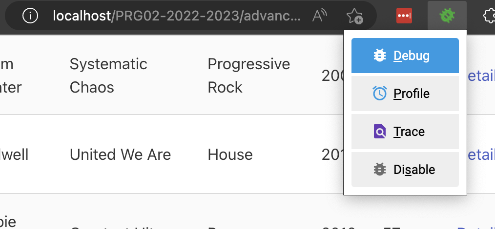
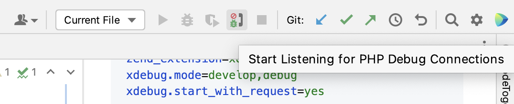
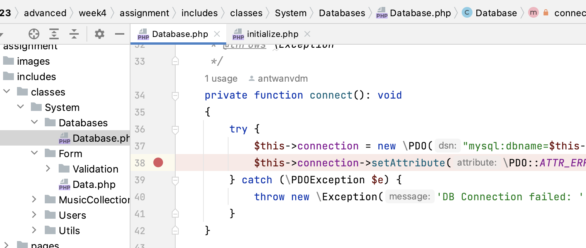
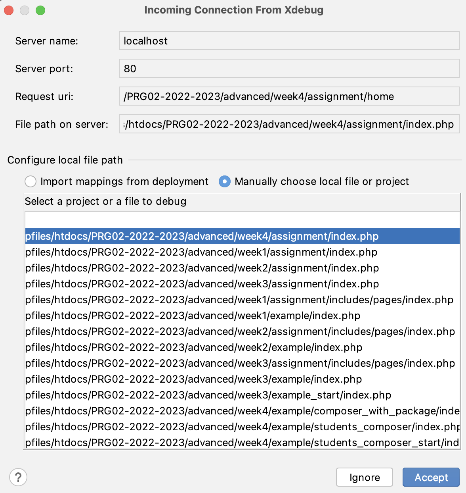
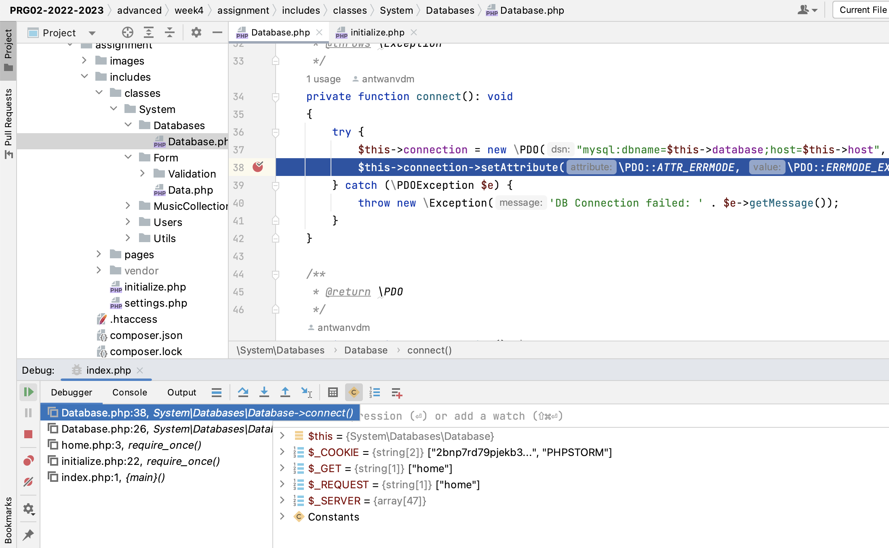

# xDebug

xDebug is een tool die je helpt de programmeerervaring een stuk aangenamer te maken.
Tot nu toe was je gewend om `print_r` of `var_dump` te gebruiken. Het werkt, maar het
geeft ook een hoop rommel omdat veel van die code vaak achterblijft in applicaties.
Ook is handmatig toevoegen van zo'n stukje code niet echt efficient en foutgevoelig.
Als je na het volgen van deze stappen xDebug aan de praat hebt, is dat verleden tijd.

Meer informatie: https://xdebug.org/

## Installatie

Om xDebug aan de praat te krijgen moet je deze installeren als PHP-extensie binnen je
XAMPP omgeving.

In je `php.ini` (gebruik de phpinfo() functie op een webpagina als je niet weet waar je
deze kunt vinden) moet je het volgende toevoegen helemaal onderaan het bestand:

**Mac:**
Volg: https://juffalow.com/blog/php/how-to-install-xdebug-on-macos-xampp/ en plaats daarna
volgende regels in je `php.ini`.

```ini
zend_extension = xdebug.so
xdebug.mode = develop,debug
xdebug.start_with_request = yes
```

**Windows:**
Volg de wizard: https://xdebug.org/wizard om de juiste package te kunnen downloaden
en configureren.

```ini
zend_extension = xdebug
xdebug.mode = develop,debug
xdebug.start_with_request = yes
```

> Let op: Na het aanpassen van de `php.ini` moet je Apache opnieuw opstarten!

### Browser plugin

Naast xDebug zelf heb je ook een plugin nodig voor in je browser. Deze zorgt er straks voor
dat je jouw applicatie toestemming geeft om te gaan debuggen. Via de betreffende plugin stores
kun je deze installeren:

- [Chrome/Edge](https://chrome.google.com/webstore/detail/xdebug-helper/eadndfjplgieldjbigjakmdgkmoaaaoc)
- [FireFox](https://addons.mozilla.org/en-US/firefox/addon/xdebug-helper-for-firefox/)
- [Safari](https://apps.apple.com/app/safari-xdebug-toggle/id1437227804?mt=12)

## Gebruik

Nu je alles hebt geïnstalleerd kun je xDebug in gebruikt gaan nemen, daarvoor kun je de volgende
stappen uitvoeren.

1. Zet je browserplugin aan op "debug"
   <br><br>
2. Zet je phpStorm "Start Listening for PHP Debug Connections" aan (icoontje met telefoontje)
   <br><br>
3. Plaats een breakpoint op een plaats waar je meer informatie over wilt verkrijgen (debugging!)
   <br><br>
4. Vernieuw de webpagina eenmalig en je wordt automatisch naar phpStorm gestuurd, accepteer hier
   de request en kies het juiste bestand wat wordt geopend.
   <br><br>
5. **YEAH!** Daar is je debuginformatie. Gefeliciteerd, vanaf nu heb je geen `print_r` en `var_dump`
   meer nodig. Welkom in de wereld van professioneel debuggen 🥳
   