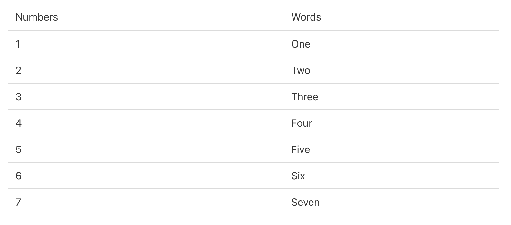

    Overzicht van de lesopdrachten van les 1

Words Table
===========

_Bij deze eerste opdracht is het de bedoeling om een tabel (met twee kolommen) te maken. In de eerste kolom komt een getal te staan (1-7) en in de tweede kolom staat het woord uitgeschreven in tekst_

> Werk de [opdracht](exercises/words-table) uit in je persoonlijke map in de htdocs folder

Greetings
=========

_Maak een pagina die de bezoeker welkom heet en op basis van de tijd goedemorgen, -middag, avond of nacht zegt._

**Greetings (ontwerp tweetallen)**

> Werk in tweetallen en één persoon beantwoordt de vragen in [Brigthspace](https://brightspace.hr.nl/d2l/le/lessons/28859/topics/231583).
>
> 1.  Welke informatie / data heb je nodig als input voor deze opdracht?
> 2.  Wat moet er stap voor stap gebeuren om het resultaat te bereiken? Let op! Je mag geen technische termen gebruiken het gaat om de functionaliteit.
> 3.  Bedenk (of zoek op) welke technische onderdelen je nodig hebt per stap.

**Greetings (uitwerking individueel)**

> Werk de [opdracht](exercises/greetings) uit in je persoonlijke map in de htdocs folder

Indexpagina: een overzicht van alle albums
==========================================

_Maak een webpagina waarop een overzicht van muziekalbums te zien is en plaats deze in een tabel_

De informatie komt uit een (associatieve) array, die je zelf hardcoded gevuld hebt met minimaal 10 albums. Hierin zit de volgende informatie:

*   Naam artiest
*   Naam album
*   Jaar van uitkomen
*   Aantal tracks
*   Genre

**Index (ontwerp tweetallen)**

> Werk in tweetallen en één persoon beantwoordt de vragen in [Brigthspace](https://brightspace.hr.nl/d2l/le/lessons/28859/topics/236084).
>
> 1.  Welke informatie / data heb je nodig als input voor deze opdracht?
> 2.  Wat moet er stap voor stap gebeuren om het resultaat te bereiken? Let op! Je mag geen technische termen gebruiken het gaat om de functionaliteit.
> 3.  Bedenk (of zoek op) welke technische onderdelen je nodig hebt per stap.

**Index (uitwerking individueel)**

> Werk de [opdracht](start) uit in je persoonlijke map in de htdocs folder

Aanvullende opdrachten
======================

_Maak de onderstaande opdrachten om met verschillende onderwerpen te oefenen_

**Samenvoegen van string**

> Werk de [opdracht](exercises/strings) uit uit de folder `exercises/strings`

**Date time**

> Werk de [opdracht](exercises/date-time) uit uit de folder `exercises/date-time`
>
> Schrijf de **huidige** datum/tijd op het scherm in verschillende notaties:
>
> *   Het is vandaag 1 november 2023” (Met de datum van vandaag)
> *   Het is vandaag 1/11/2023” (Met de datum van vandaag)
> *   Het is nu 2 uur en 30 minuten” (of: “het is nu 6 uur en 1 minuut”)

**Zodiac Sign**

> Werk de [opdracht](exercises/zodiac-sign) uit uit de folder `exercises/zodiac-sign`
>
> Maak een webpagina die laat zien welk sterrenbeeld je hebt op basis van je verjaardag. Je verjaardag mag je hardcoded verwerken