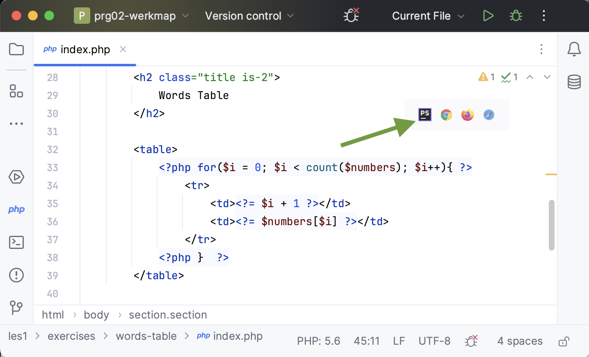
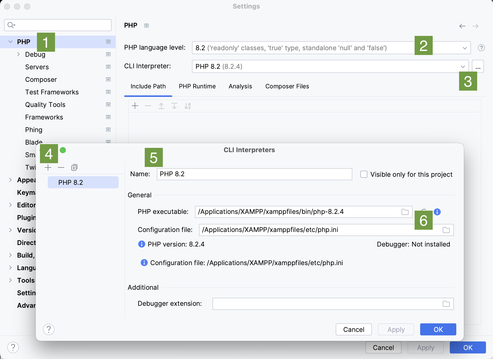
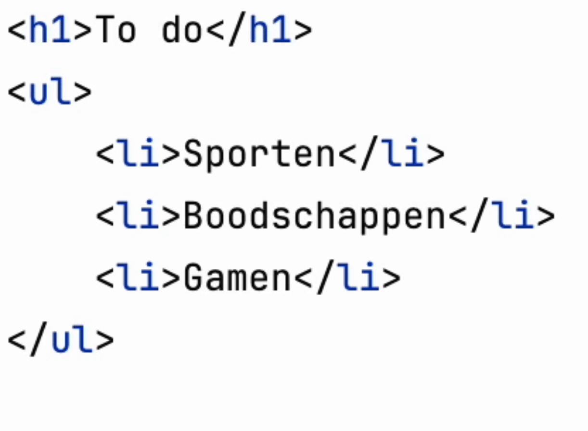
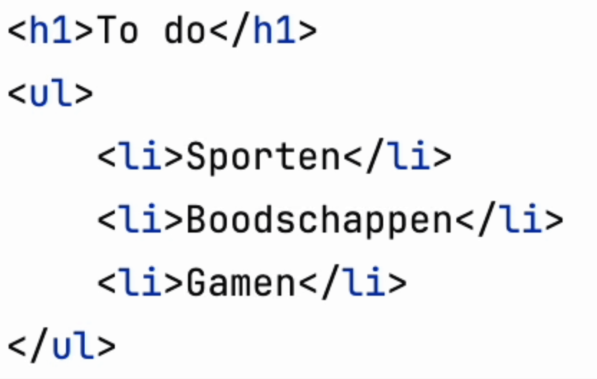
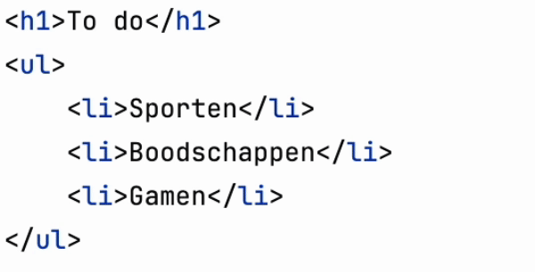

# Pro tips PhpStorm

 

**Inhoudsopgave**

- [Pro tips PhpStorm](#pro-tips-phpstorm)
- [Inleiding](#inleiding)
- [Preview](#preview)
- [Shortcuts](#shortcuts)
    - [Regel omhoog/omlaag](#regel-omhoogomlaag)
    - [Regel dupliceren](#regel-dupliceren)
    - [Regel verwijderen](#regel-verwijderen)
    - [Meerdere regels tegelijkertijd bewerken](#meerdere-regels-tegelijkertijd-bewerken)

 
 

# Inleiding

Op deze pagina vind je een aantal pro tips voor het gebruik van PhpStorm.

# Preview

Rechts bovenin je code zie je het icoontje van PhpStorm staan en van drie browsers. Wanneer je op één van deze icoontjes
klikt opent zich een preview-weergave van jouw code die automatisch ververst wanneer je de code aanpast. Handig, alleen
moet je hiervoor wel eerst iets instellen.

Open de instellingen van PhpStorm en doorloop de volgende stappen, die corresponderen met onderstaand screenshot:

1. Klik links op `PHP`
2. Kies in de dropdown `PHP 8.2`
3. Klik op de drie puntjes, zodat de popup zich opent
4. Klik op het plusje
5. Voer de naam `PHP 8.2` in
6. Voer het juiste pad in naar php en de php.ini. In onderstaand screenshot staat het pad voor Macbook, maar voor Windows is hij hetzelfde van `XAMPP/`

Sla dit nu op en je zou de preview-knopjes moeten kunnen gebruiken.

 

# Shortcuts

## Regel omhoog/omlaag

| OS      | Shortcut              |
|---------|-----------------------|
| Windows | Alt + Shift + Up/Down |
| Mac     | ⌥⇧ Up/Down            |

## Regel dupliceren

| OS      | Shortcut |
|---------|----------|
| Windows | Ctrl + D |
| Mac     | ⌘D       |

## Regel verwijderen

| OS      | Shortcut |
|---------|----------|
| Windows | Ctrl + Y |
| Mac     | ⌘⌫       |

## Meerdere regels tegelijkertijd bewerken

**Per regel**

| OS      | Shortcut   |
|---------|------------|
| Windows | ???        |
| Mac     | ⌥ muisklik |

**Meerdere regels onder elkaar**

| OS      | Shortcut                                          |
|---------|---------------------------------------------------|
| Windows | ???                                               |
| Mac     | ⌥⇧ muisklik + naar beneden/boven gaan met je muis |

